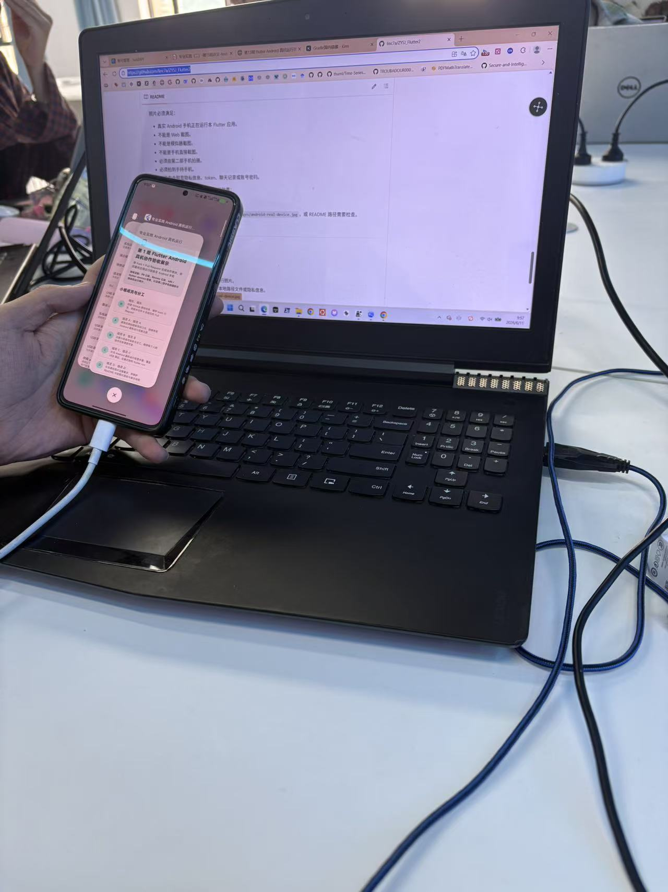

# 专业实践（二）第15周 Flutter Android 真机运行展示项目

本项目用于《专业实践（二）》第15周课堂练习，延续第14周 Flutter Web 入门与 GitHub 小组协作实践。

本周只使用一种协作方式：**组长创建原始仓库，组员 Fork 后提交 Pull Request，组长审核并合并**。组员不直接 push 组长仓库的 `main` 分支，也不要求组长把组员加入 collaborator。

项目目标不是比拼复杂功能，而是形成一份真实项目验收证据：代码协作记录、PR 记录、Review 记录、真实 Android 手机运行照片和 README 展示。

## 项目展示内容

应用首页展示本组第15周 Flutter Android 真机运行成果，包含以下信息：

- 项目标题和实践口号。
- 组长、组员 A、组员 B、组员 C、组员 D 的协作分工。
- Android 真机运行前后的检查步骤。
- 真机运行照片的验收要求和 README 图片路径。

> 说明：如果要提交真实小组作业，请把 `lib/main.dart` 中的 `组长`、`组员 A`、`组员 B`、`组员 C`、`组员 D` 替换为你们小组成员真实姓名。

## 课堂下载与环境准备

课堂校内下载站：

```text
http://10.50.2.92/course-mobile-week15/
```

下载站提供 Android Studio、Flutter SDK、Android Platform-Tools、Android Command-line Tools 和 `checksums.sha256`。每组优先保障一台主运行电脑跑通。下载慢时，可以使用 U 盘、移动硬盘或局域网共享互相拷贝；拷贝后仍必须在本机运行检查命令。

建议先阅读讲义中的“Step 2：先解决下载问题”和“Step 2.5：前置避坑清单”。课堂最容易卡住的是：GitHub 推送认证、中文或空格路径、USB 文件传输模式、厂商 USB 调试权限、Gradle 首次构建下载、PR 目标仓库和 README 图片路径。

## 运行前避坑清单

- Flutter SDK 和本项目路径尽量使用短英文路径，例如 `C:\dev\flutter` 和 `C:\dev\professional_practice_flutter_android`。
- 本课程 GitHub 远程地址使用 HTTPS。
- GitHub HTTPS 推送不能使用账号密码；如果 `git push` 报 password authentication removed，请使用 Git Credential Manager、Personal Access Token 或 GitHub Desktop 完成认证。
- token 不能发群、不能截图、不能写进 README 或代码。
- 组长创建 GitHub 仓库时要创建空仓库，不要勾选 README、`.gitignore` 或 license。
- 手机连接电脑后，USB 模式选择文件传输 / MTP / 传输文件，并在手机上允许 USB 调试。
- `flutter pub get` 和 Gradle 下载不是同一件事。第一次 `flutter run` 卡在 `Running Gradle task 'assembleDebug'` 时，按讲义中的 Gradle / Maven 国内仓库小节检查。
- 真机照片建议压缩到 2MB 到 5MB 左右，README 图片路径大小写要和文件名完全一致。

## 运行要求

进入项目根目录后执行：

```bash
flutter pub get
flutter analyze
flutter test
flutter run
```

如果有多台设备，先查看设备：

```bash
adb devices
flutter devices
```

再指定 Android 设备运行：

```bash
flutter run -d 设备ID
```

## Android 真机连接检查

连接 Android 手机后，建议先检查：

```bash
adb devices
flutter devices
```

`adb devices` 中设备状态必须是：

```text
device
```

如果是 `unauthorized`，请解锁手机并点击允许 USB 调试。

## 小组分工

| 角色 | 建议分支 | 修改位置 | 任务 |
| --- | --- | --- |
| 组长 | `main` | GitHub 仓库 | 创建仓库、维护 main、审核 PR、组织真机运行 |
| 组员 A | `feature/title-slogan` | `lib/main.dart` | 修改 `projectTitle` 和 `projectSlogan` |
| 组员 B | `feature/members` | `lib/main.dart` | 修改 `members` 中的小组成员姓名和分工 |
| 组员 C | `feature/android-tasks` | `lib/main.dart` | 修改 `androidTasks` 中的真机运行任务 |
| 组员 D | `feature/evidence-readme` | `lib/main.dart` 和 `README.md` | 修改 `evidenceNotes`，补充 README 真机照片说明 |

## 已整理的真机运行检查步骤

1. 确认主运行电脑已安装 Flutter SDK、Android Studio、Android SDK、Platform-Tools 和 Git。
2. 把项目放在短英文路径中，先执行 `flutter pub get`、`flutter analyze` 和 `flutter test`。
3. 连接真实 Android 手机，开启开发者选项、USB 调试，并选择文件传输 / MTP 模式。
4. 执行 `adb devices`，确认设备状态是 `device`。
5. 执行 `flutter devices`，确认 Flutter 能识别到 Android 真机设备。
6. 执行 `flutter run` 或 `flutter run -d 设备ID`，把最终版本运行到真实 Android 手机。
7. 运行成功后，用第二部手机拍摄手持真机运行照片，并保存到 `images/android-real-device.jpg`。

## Android 真机运行照片

完成真机运行后，把照片保存为：

```text
images/android-real-device.jpg
```

然后在 README 中引用：

```markdown

```

照片必须满足：

- 真实 Android 手机正在运行本 Flutter 应用。
- 不能是 Web 截图。
- 不能是模拟器截图。
- 不能是手机直接截图。
- 必须由第二部手机拍摄。
- 必须拍到手持手机。
- 不能包含明显隐私信息、token、聊天记录或账号密码。

提交照片后，下面应显示本组真机运行效果：


如果这里暂时显示不出图片，说明还没有提交 `images/android-real-device.jpg`，或 README 路径需要检查。

## 最终提交清单

组长提交：

- GitHub 原始仓库地址。
- 4 名组员 PR 已 Review 并 Merge。
- `main` 分支能看到最终代码。
- README 能看到 Android 真机运行照片。
- 仓库中没有 token、账号密码、本地路径文件或隐私信息。

每名组员提交：

- 自己的 PR 链接或截图。
- 自己负责的修改区域说明。
- 自己的 commit 或 PR 能在 GitHub 中看到。

小组共同检查：

- 至少一台真实 Android 手机运行成功。
- `adb devices` 出现 `device`。
- `flutter devices` 能看到 Android 手机。
- 照片已加入 README，并能在 GitHub 网页正常显示。
